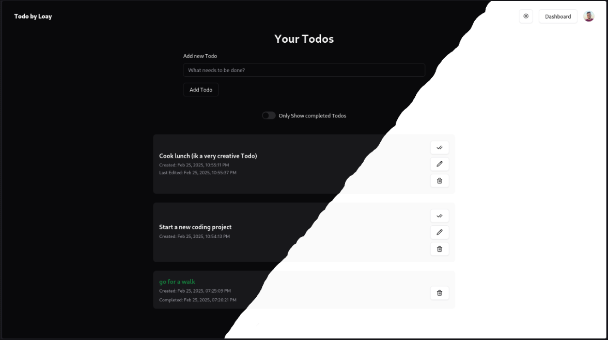

# Todo
 
This is a simple Todo web app built with:

- **Next.js**
- **Clerk** for authentication and user management
- **Supabase** for a **PostgreSQL** database with **Row-Level Security (RLS)**, secured based on authentication state from Clerk
- **shadcn/ui** for fast components and theming (light/dark mode)
- **Tailwind CSS** for styling
- **TypeScript** for type safety
- **Vercel** for deployment

## Features

Each user can:

- Sign in / Sign out (w/ Email, Google account, or GitHub)
- View their own Todos
- Add new Todos
- Mark existing Todos as completed
- Delete existing Todos
- Filter to show only completed Todos

## General:

- Data fetching is handled via a **RESTful API**, set up as a server route in Next.js
- The main Dashboard route is protected; unauthenticated users are redirected to sign in
- All API routes are secured, ensuring that only the Todo's owner can modify it
- When a user performs an action that requires fetching data, a **skeleton loader** or **loading spinner** is displayed to indicate that the process is in progress
- Buttons that trigger actions are disabled while data is being fetched to prevent multiple submissions (e.g., double adding or deleting Todos)

## Todo (pun intended):

- Implement end-to-end encryption
- Add ability to edit Todo contents
- Fix Google / GitHub sign-up
